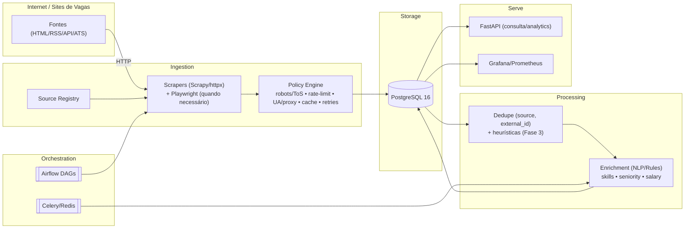
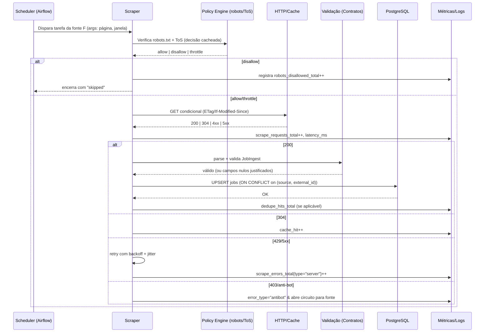

# Arquitetura — Visão Geral

> Objetivo: coletar, enriquecer e servir vagas de tecnologia com **robustez**, **conformidade** e **observabilidade**.

## Princípios & NFRs
- **Compliance-first:** obedecer `robots.txt`/ToS; sem login, sem burlar captcha/anti-bot; parar mediante sinais de bloqueio.
- **Confiabilidade:** idempotência, dedupe `(source, external_id)`, retries com backoff + circuit breaker; SLOs por fonte.
- **Escalabilidade:** paralelismo controlado, rate limit adaptativo por fonte, cache HTTP (ETag/Last-Modified).
- **Qualidade de dados:** contratos de dados, campos mínimos, validação e métricas de erro.
- **Observabilidade:** logs estruturados, métricas Prometheus, alertas com error budget.
- **DX:** 12-factor, configs via `.env`, Make/CI, docs por fonte.

## Visão Macro (Containers)

## Fluxo de Dados (Sequência)

## Componentes & Responsabilidades

* **Source Registry:** catálogo versionado das fontes (método: HTML/RSS/API/ATS; SLOs; risco; política).
* **Scraper Runtime:** Scrapy (crawl/pipelines) + httpx; Playwright apenas se necessário e permitido.
* **Policy Engine:** checagem de robots/ToS; rate limit dinâmico; user-agent/proxy rotation; stop rules.
* **HTTP Layer:** timeouts, retries/backoff, cache condicional; circuit breaker por domínio.
* **Storage (PostgreSQL):** esquema canônico; índices em `posted_at`/`scraped_at`; JSONB para `tags`.
* **Dedupe:** constraint (source, external_id) + heurísticas futuras (Levenshtein ±2d).
* **Enrichment:** extração de skills/senioridade/salário com regras/NLP; jobs de pós-processamento via Celery.
* **API (FastAPI):** filtros (keyword, seniority, location, remote, salary, company) e agregações (top-N skills, tendências).
* **Observability:** logs JSON, métricas Prometheus, dashboards e alertas (erro/freshness/latência).

## Fronteiras de Confiança & Compliance

* **Internet ↔ Ingestion:** respeitar `robots.txt`/ToS; sem login/captcha bypass; limitar RPS; honrar `Retry-After`.
* **Ingestion ↔ Storage:** upserts idempotentes; transações curtas; schemas versionados (Alembic).
* **Serve ↔ Consumidores:** sanitização/escape do HTML; rate limit de API; paginação e filtros seguros.
* **LGPD:** sem PII de candidatos; dados somente públicos; logs com IP ofuscado/rotação de 30 dias.

## Escalabilidade & Resiliência

* **Capacidade alvo (MVP):** ≥10k vagas/dia; janela de coleta < 2h.
* **Paralelismo:** por domínio (N) e global (G) com “crawl budget” por fonte.
* **Backpressure:** reduzir paralelismo e aumentar intervalo sob erro ≥5%/10 min.
* **Idempotência:** UPSERT por (source, external_id); retriable sem duplicar.
* **Falhas parciais:** circuit breaker por fonte; fila de retry tardio (Celery beat).

## Qualidade de Dados & Contratos

* **Campos mínimos:** `title`, `source`, `source_url`, `scraped_at`.
* **Moeda/Idioma:** ISO 4217/639-1.
* **Contratos (Pydantic):** validações de tipos/intervalos; campos não inferíveis → `null` + log.

## Observabilidade (Métricas & Alertas)

* `scrape_requests_total`, `scrape_errors_total{type}`, `scrape_latency_ms`, `robots_disallowed_total`, `dedupe_hits_total`.
* **Alertas exemplos:** erro ≥5%/10 min; freshness mediana >48h em fontes diárias; p95 latência >3s.

## Segurança

* Segredos via `.env`/secret manager.
* Dependência monitorada (dependabot/safety).
* Sanitização/escape ao servir HTML.

## Itens Abertos / Known Issues

* `skills.created_at` deve ser `timestamptz` (corrigir ORM + migração).
* Validar tamanhos máximos (`source_url` até 1024) na API.
