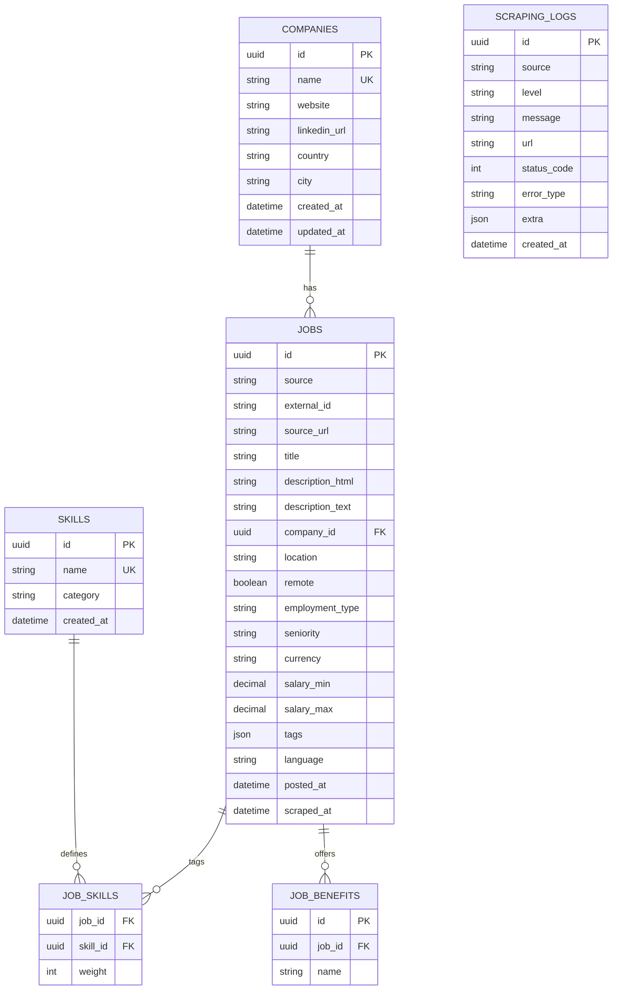

# Modelo de Dados (PostgreSQL)

## Tabelas

### companies

* `id (uuid, pk)` — gerado via `gen_random_uuid()`
* `name (str, unique, not null)`
* `website (str?)`, `linkedin_url (str?)`, `country (str?)`, `city (str?)`
* `created_at`, `updated_at` (timestamptz)

### jobs

* `id (uuid, pk)`
* `external_id (str?)` + `source (str, not null)` **UNIQUE (source, external_id)**
* `source_url (str, not null)`
* `title (str, not null)`, `description_html (text?)`, `description_text (text?)`
* `company_id (uuid?)` FK→companies (on delete set null)
* `location (str?)`, `remote (bool)`, `employment_type (str?)`, `seniority (str?)`
* `currency (char(3)?)`, `salary_min/max (numeric?)`
* `tags (jsonb?)`, `language (char(5)?)`
* `posted_at (timestamptz?)`, `scraped_at (timestamptz not null)`
* Índices: `(posted_at)`, `(scraped_at)`

### skills

* `id (uuid, pk)`, `name (str unique, not null)`, `category (str?)`, `created_at (timestamptz)`

### job_skills

* `job_id (uuid, pk, fk)`, `skill_id (uuid, pk, fk)`, `weight (int?)`

### job_benefits

* `id (uuid, pk)`, `job_id (uuid fk, on delete cascade)`, `name (str, not null)`
* UNIQUE `(job_id, name)`

### scraping_logs

* `id (uuid, pk)`, `source (str)`, `level (str)`, `message (text)`
* `url (str?)`, `status_code (int?)`, `error_type (str?)`, `extra (jsonb?)`
* `created_at (timestamptz, indexed)`

## Padrões de Qualidade

* **Freshness**: `scraped_at` obrigatório.
* **Moedas**: ISO 4217 (3 letras).
* **Idioma**: ISO 639-1 (`pt`, `en`, ...).
