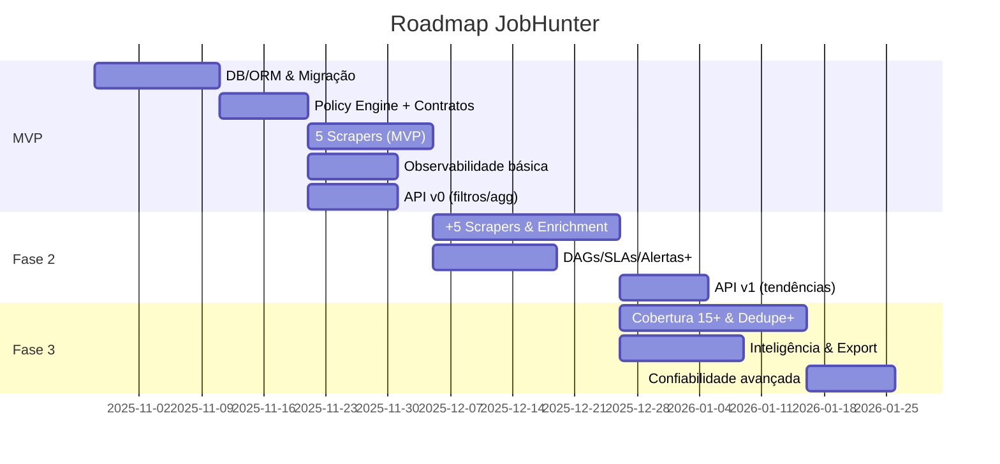

# Roadmap (Dev Path)

> Linha-mestra para entregar MVP → Fase 2 → Fase 3, com marcos, SLOs e riscos.

## Marcos & Resultados Esperados
### MVP (Semanas 0–8)
- **Infra & DB:** Postgres + Alembic + ORM estável; migração inicial aplicada.
- **Ingestion Base:** Policy Engine (robots/ToS, rate-limit, retries, cache); contratos Pydantic.
- **Fontes (≥5):** WeWorkRemotely, RemoteOK, Remote.co, Greenhouse, Workable (tenants públicos).
- **Dedupe:** `(source, external_id)` + UPSERT.
- **Observabilidade:** métricas básicas + dashboards; alertas de erro/freshness.
- **API (v0):** filtros principais e agregações básicas.
- **SLOs MVP:** erro extração <5%; janela <2h; uptime ≥99% (horário comercial).

### Fase 2 (Semanas 9–16)
- **Fontes 10+:** Lever, Ashby, Gupy (quando permitido), carreiras BR (Nubank, iFood, etc. via ATS).
- **Enrichment:** NLP para skills/seniority/salário (regras + spaCy).
- **Orquestração:** DAGs com prioridades/SLAs; Celery p/ pós-processo.
- **API (v1):** endpoints de tendências e top-N skills; paginação e ordenação.
- **Observabilidade+:** error budgets e alertas compostos.

### Fase 3 (Semanas 17–24)
- **Cobertura 15+:** restante das fontes priorizadas (apenas permissivas).
- **Heurísticas Dedupe+:** similaridade de título+empresa±2d.
- **Inteligência:** relatórios/tendências, export (CSV/Parquet).
- **Confiabilidade:** blue/green deploy da API, throttling adaptativo global.

## Gantt (alto nível)

## Workstreams & Entregas

* **Ingestion:** base Scrapy/httpx, Playwright opcional; políticas, cache, parsers.
* **DB/ORM:** modelos, migrações, índices; retenção e manutenção.
* **Enrichment:** regras + NLP (skills/seniority/salário).
* **API:** filtros/agg; autenticação e rate limit básico.
* **Observabilidade:** métricas, dashboards, alertas.
* **Orquestração:** DAGs, SLAs, retries; Celery para pós-processos.
* **Compliance & Segurança:** checagens por fonte, UA/proxy, stop rules.
* **DX & Qualidade:** testes ≥80%, fixtures HTTP, VCR (quando aplicável).

## Critérios de Aceite por Marco

* **MVP pronto quando:** 5 fontes ativas, erro <5%, 10k vagas/dia, API v0 operante, dashboards ativos.
* **Fase 2 pronta quando:** 10+ fontes, enrichment em produção, API v1 com tendências, SLAs monitorados.
* **Fase 3 pronta quando:** 15+ fontes, dedupe heurístico habilitado, relatórios e export.

## Prioridade de Fontes (Onda a Onda)

1. **MVP:** WWR, RemoteOK, Remote.co, Greenhouse, Workable.
2. **Fase 2:** Lever, Ashby, Gupy (quando permitido), carreiras BR (via ATS).
3. **Fase 3:** Outras tech boards permissivas. **Restritas (LinkedIn/Glassdoor):** blueprint/mock apenas.

## Riscos & Mitigações

* **ToS/robots alteradas** → monitoramento diário + “stop switch”; fallback para feeds/APIs.
* **Antibot/WAF** → reduzir taxa, intervalos aleatórios, cache agressivo; nunca burlar.
* **Dados ruidosos** → contrachecagem e validação; registrar campos nulos justificadamente.
* **Custo/latência** → priorização por fonte/página; crawl budget dinâmico.

## Definition of Ready / Done

* **DoR:** ficha da fonte (`docs/scrapers/<fonte>.md`), amostra HTML/JSON, regras de paginação, limites/ToS confirmados.
* **DoD:** parser cobriu casos; contratos validados; dedupe ok; métricas/logs; testes/fixtures; doc atualizada.

## Labels & PR Checklist

* Labels: `source:<nome>`, `compliance`, `observability`, `api`, `db`, `enrichment`.
* Checklist: ver `docs/review_checklist.md`.
